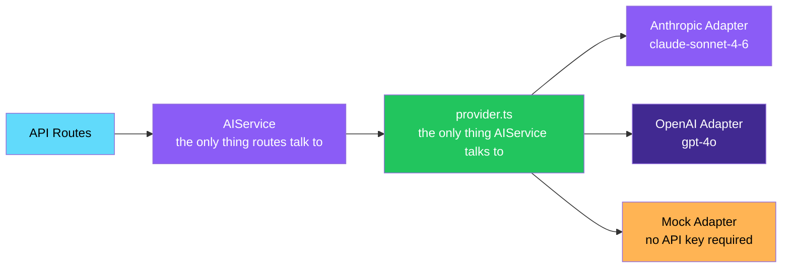

# 📒 Ledger — AI Business Plan Builder

<div align="center">


**From a raw idea to an investor-ready business plan.**

*Guided wizard · AI-assisted drafting · Real financials · PDF & DOCX export*

[✨ Features](#-whats-fully-implemented) • [🏗️ Architecture](#️-architecture) • [🚀 Setup](#1-install-dependencies) • [🔐 Security](#-notes-on-security) • [📝 Scope](#-whats-fully-implemented-vs-simplified)

</div>

---

## 📖 Overview

**Ledger** is a full-stack app that walks someone with **no business-plan experience** from a **raw idea** to a **formatted, exportable, investor-ready business plan**.

### Core Idea

> **AI assists. The wizard guides. The output is real.**
>
> Every financial calculation is computed server-side, every export is a real PDF or DOCX, and the AI layer is provider-agnostic — swap Anthropic for OpenAI, or run the whole app with no key at all.

### 🛠️ Stack

| Layer | Technology |
|-------|-----------|
| **Frontend** | React · TypeScript · Vite · Tailwind CSS |
| **Backend** | Node.js · TypeScript · Express |
| **Database** | PostgreSQL via Prisma ORM |
| **AI** | Provider-agnostic `AIService` — Anthropic or OpenAI adapter, with a mock fallback so the app runs **with no API key** |
| **Export** | Real PDF (`pdfkit`) and DOCX (`docx`) generation |

---

## ✨ What's Fully Implemented

<div align="center">

| 🔐 Auth | 📋 Plan CRUD |
|:---:|:---:|
| Email/password + Google sign-in | Create, read, update, delete business plans |
| **🧙 Guided Wizard** | **💰 Live Financials** |
| Business info · products with live margin calc · customer personas · SWOT with AI generation | Break-even · 36-month projection · charts |
| **🧠 AI Service Layer** | **📤 Real Export** |
| Every function from the spec, provider-agnostic | Actual PDF and DOCX generation |
| **🔗 Share Links** | **📑 Plan Duplication** |
| Public, read-only plan sharing | Fork any plan as a starting point |
| **🌱 Demo Seed** | **🎨 Interactive UI** |
| "Urban Bean Coffee" — a fully filled-in plan you can explore immediately | SWOT board · financial dashboard · floating AI assistant |

</div>

### Detailed Feature List

#### 🔐 Authentication

- **Email/password** registration and login
- **Google sign-in**
- bcrypt password hashing

#### 📋 Plan CRUD

Create, read, update, and delete business plans — each scoped to its owner.

#### 🧙 The Guided Wizard

| Step | What It Does |
|------|-------------|
| **Business Info** | Name, industry, description, stage |
| **Products** | Add products with **live margin calculation** |
| **Customer Personas** | Define who you're selling to |
| **SWOT** | Strengths, weaknesses, opportunities, threats — **with AI generation** |
| **Financials** | Break-even, 36-month projection, and charts |

#### 🧠 AI Service Layer

**Every function from the spec, provider-agnostic.**

| Provider | Adapter |
|----------|---------|
| **Anthropic** | `AnthropicProvider` |
| **OpenAI** | `OpenAIProvider` |
| **Mock** | Runs with no API key — clearly labeled placeholder responses |

#### 📤 Export

- **Real PDF** generation via `pdfkit`
- **Real DOCX** generation via `docx`

#### 🔗 Share Links

Public, read-only links to any plan.

#### 📑 Plan Duplication

Fork any plan as a starting point for a new one.

#### 🌱 Demo Seed

**"Urban Bean Coffee"** — a fully filled-in plan so you can see the app with real data **immediately**.

#### 🎨 Interactive UI

- **Interactive SWOT board** — drag-and-drop-ready grid
- **Financial dashboard** with charts
- **Floating AI assistant** available throughout the wizard

---

## 🏗️ Architecture

### System Overview

```mermaid
flowchart TB
    subgraph CLIENT["🖥️ Frontend (React + Vite)"]
        Pages["Pages<br/>Landing · Login · Register<br/>Dashboard · Wizard · Document"]
        Wizard["Wizard Steps<br/>business · products · personas · SWOT · financials"]
        Components["Components<br/>SWOT board · financial charts<br/>AI assistant"]
        Stores["Zustand<br/>auth · theme"]
        APIClient["API Client<br/>axios"]
    end

    subgraph SERVER["⚙️ Backend (Express + TypeScript)"]
        Routes["Routes<br/>REST endpoints"]
        Controllers["Controllers"]
        Middleware["Middleware<br/>auth · rate limit · errors"]
        Validators["Validators<br/>zod schemas"]
        Services["Services"]
    end

    subgraph SERVICES["📚 Service Layer"]
        AIService["AIService<br/>the abstraction every route uses"]
        Provider["Provider Adapters<br/>Anthropic · OpenAI · mock"]
        Financial["financialService<br/>break-even · projections<br/>ROI · runway"]
        Completion["completionService<br/>plan quality score"]
        Export["exportService<br/>PDF · DOCX"]
    end

    subgraph DATA["🗄️ Data"]
        Prisma["Prisma ORM"]
        Postgres[("PostgreSQL")]
    end

    CLIENT -->|REST| SERVER
    SERVER --> SERVICES
    SERVICES --> DATA

    style CLIENT fill:#61DAFB,color:#000
    style SERVER fill:#000,color:#fff
    style SERVICES fill:#8B5CF6,color:#fff
    style DATA fill:#316192,color:#fff
```



### The AI Abstraction — One Interface, Three Backends



> 💡 **`AIService` is the only thing routes talk to. `provider.ts` is the only thing `AIService` talks to.** Swapping providers — or adding a new one — touches exactly one file.

### Request Flow

```mermaid
flowchart LR
    Request["Incoming Request"] --> Helmet["helmet<br/>security headers"]
    Helmet --> RateLimit["express-rate-limit<br/>auth and AI throttled separately"]
    RateLimit --> Auth["auth middleware<br/>JWT verification"]
    Auth --> Zod["Zod validation"]
    Zod --> Controller["Controller"]
    Controller --> Service["Service<br/>business logic"]
    Service --> Prisma["Prisma"]
    Prisma --> DB[("PostgreSQL")]

    style Request fill:#61DAFB,color:#000
    style Helmet fill:#22C55E,color:#fff
    style RateLimit fill:#FF6B6B,color:#fff
    style Auth fill:#8B5CF6,color:#fff
    style Zod fill:#FFB454,color:#000
    style Service fill:#0f3460,color:#fff
    style DB fill:#316192,color:#fff
```



### Design Principles

<div align="center">

| Principle | Implementation |
|-----------|---------------|
| **🧠 AI is abstracted** | `AIService` is the only interface routes use; `provider.ts` is the only thing `AIService` talks to |
| **🔌 Providers are swappable** | Anthropic, OpenAI, and mock adapters implement the same interface — one file to change, one file to add |
| **🚫 No key required** | With `AI_API_KEY` unset, the mock adapter returns clearly-labeled placeholder responses — the app still runs end to end |
| **💰 Financials are computed** | Break-even, projections, ROI, and runway are server-side math, not AI guesses |
| **📤 Export is real** | PDF and DOCX are actually generated, not printed from the browser |
| **🛡️ Defense in depth** | Helmet, rate limiting, JWT auth, and Zod validation on every path |
| **🔐 Key stays server-side** | The AI API key never reaches the browser — all AI calls are proxied |
| **📐 Zod validates every request** | Nothing touches the database until the request body has been validated |

</div>

### Project Structure

```
business-plan-builder/
├── backend/           # Express API + Prisma
│   ├── prisma/schema.prisma   # all 20+ models from the spec
│   └── src/
│       ├── routes/            # REST endpoints
│       ├── controllers/
│       ├── services/
│       │   ├── ai/provider.ts # Anthropic/OpenAI/mock adapters
│       │   ├── aiService.ts   # AIService — the abstraction every route uses
│       │   ├── financialService.ts   # break-even, projections, ROI, runway
│       │   ├── completionService.ts  # plan quality score
│       │   └── exportService.ts      # PDF/DOCX generation
│       ├── middleware/        # auth, rate limiting, error handling
│       └── validators/        # zod schemas
│
└── frontend/          # React app
    └── src/
        ├── pages/              # Landing, Login, Register, Dashboard, Wizard, Document
        ├── components/
        │   ├── wizard/         # step components + progress bar
        │   ├── swot/           # interactive SWOT board
        │   ├── financial/      # financial dashboard + charts
        │   └── ai/             # floating AI assistant
        ├── stores/             # zustand: auth, theme
        └── services/api.ts     # axios client
```

---

## 📝 What's Fully Implemented vs. Simplified

> **This is a real, running codebase, not a mockup** — but given the size of the original spec, **some pieces are intentionally scoped down so everything else actually works end to end.**

### ✅ Fully Implemented

- **Auth** — email/password + Google
- **Plan CRUD**
- **The wizard** — business info, products with live margin calc, customer personas, SWOT with AI generation, financials with break-even + 36-month projection + charts
- **The AI service layer** — all functions from the spec, provider-agnostic
- **PDF and DOCX export**
- **Share links**
- **Plan duplication**
- **Demo seed** — "Urban Bean Coffee"

### 🚧 Scoped Down for This Pass

| Area | Current State |
|------|--------------|
| **Business Model Canvas** | Modeled in the database, has working API routes — **no dedicated wizard-step UI yet** |
| **Marketing / Sales / Operations / Team wizard steps** | Same — modeled, API-complete, UI pending |
| **Drag-and-drop** | Same |
| **Password reset emails** | **Log to the console** instead of sending real email — swap in a provider like Postmark/SendGrid where noted in `authController.ts` |

> 💡 **The pattern in `StepProduct.tsx` / `SwotBoard.tsx` is the template to extend them** — each is a **~60-line component**.

---

## 🚀 Setup

### 1. Install Dependencies

```bash
cd backend && npm install
cd ../frontend && npm install
```

### 2. Set Environment Variables

```bash
cd backend
cp .env.example .env
# edit .env: set JWT_SECRET, and AI_PROVIDER/AI_API_KEY if you want real AI output
# (with AI_API_KEY unset, AI endpoints return a clearly-labeled placeholder response)
```

### 3. Start PostgreSQL

Easiest option, with Docker:

```bash
docker compose up -d
```

Or point `DATABASE_URL` in `backend/.env` at any Postgres instance you already have.

### 4. Run Database Migrations

```bash
cd backend
npx prisma migrate dev --name init
```

### 5. Seed Demo Data

```bash
npm run prisma:seed
```

**This creates:**

- **14 starter templates**
- A **demo login:** `demo@businessplanbuilder.app` / `Demo1234!`
- A **fully filled-in "Urban Bean Coffee" plan** — so you can see the app with real data immediately

### 6. Start the Backend

```bash
cd backend
npm run dev
# API on http://localhost:4000
```

### 7. Start the Frontend

```bash
cd frontend
npm run dev
# App on http://localhost:5173 (proxies /api to the backend)
```

### 8. Connect the AI API

In `backend/.env`:

```env
AI_PROVIDER=anthropic        # or "openai"
AI_API_KEY=sk-ant-...
AI_MODEL=claude-sonnet-4-6   # or "gpt-4o" for openai
```

> 🔒 **Never put this key in the frontend.**
>
> All AI calls are proxied through the backend's **`AIService`** (`backend/src/services/aiService.ts`), which is the only place that talks to **`backend/src/services/ai/provider.ts`**.

### 9. Building for Production

#### Backend

```bash
cd backend && npm run build && npm start
```

#### Frontend

```bash
cd frontend && npm run build   # outputs static files to frontend/dist
```

Serve `frontend/dist` from any static host *(Vercel, Netlify, nginx)* and point it at your deployed backend via a **reverse proxy** or a **`VITE_API_URL`-style env var** if you split the domains.

---

## 🔐 Notes on Security

<div align="center">

| Protection | Implementation |
|-----------|---------------|
| **Password hashing** | bcrypt, **12 rounds** |
| **Session tokens** | JWTs signed with `JWT_SECRET` |
| **Security headers** | `helmet` sets standard headers |
| **Rate limiting** | `express-rate-limit` throttles **auth and AI endpoints separately** from general API traffic |
| **AI key isolation** | The AI API key lives **only in the backend's environment** — it's never sent to or readable from the client bundle |
| **Input validation** | **Zod validates every request body** before it touches the database |

</div>

---

## 🗺️ Roadmap

### ✅ Current

- [x] Email/password authentication
- [x] Google sign-in
- [x] bcrypt password hashing (12 rounds)
- [x] JWT session tokens
- [x] Plan CRUD with owner scoping
- [x] Wizard step: Business Info
- [x] Wizard step: Products with live margin calculation
- [x] Wizard step: Customer Personas
- [x] Wizard step: SWOT with AI generation
- [x] Wizard step: Financials with break-even and 36-month projection
- [x] Financial dashboard with charts
- [x] Interactive SWOT board
- [x] Floating AI assistant
- [x] Provider-agnostic AI service (Anthropic, OpenAI, mock)
- [x] PDF export via `pdfkit`
- [x] DOCX export via `docx`
- [x] Public share links
- [x] Plan duplication
- [x] Plan completion score
- [x] Demo seed with 14 templates and "Urban Bean Coffee"
- [x] Helmet, rate limiting, Zod validation
- [x] Docker Compose for PostgreSQL

### 🔜 Future Ideas

- [ ] **Business Model Canvas** — dedicated wizard-step UI
- [ ] **Marketing / Sales / Operations / Team** — dedicated wizard-step UI
- [ ] **Drag-and-drop** — for reordering wizard steps and canvas blocks
- [ ] **Real password reset emails** — Postmark, SendGrid, etc.
- [ ] **Streaming AI responses** — token-by-token for a more responsive assistant
- [ ] **Collaborative editing** — multiple authors on one plan
- [ ] **Version history** — restore previous draft states
- [ ] **Investor presentation mode** — slides from any plan
- [ ] **Multi-language plans** — export in any language
- [ ] **Excel financial model export**

---

## 🤝 Contributing

Contributions are welcome. Please:

1. Fork the repository
2. **Never expose the AI API key** — it must remain server-side
3. **Never bypass `AIService`** — all AI calls go through it
4. **Never bypass `provider.ts`** — new providers implement the same interface
5. **Validate every request body** with Zod before it touches the database
6. **Keep financial math server-side** — break-even, projections, and ROI are not AI guesses
7. **Preserve export fidelity** — PDF and DOCX must remain real, not print-to-PDF
8. Submit a Pull Request

### Guidelines

- **Never let the AI invent numbers** — financials are computed, not generated
- **Never throttle only the frontend** — rate limits belong on the server
- **Never log secrets** — the AI key and JWT secret must not appear in logs
- **Never expose another user's plan** — every route re-checks ownership
- **Never ship a real `.env`** — use `.env.example` as the template

---

## 📜 License

MIT — see [LICENSE](LICENSE) for details.

---

## 🙏 Acknowledgments

- **Anthropic and OpenAI** — for making the AI layer provider-agnostic possible
- **pdfkit and docx** — for making real document export approachable
- **Prisma** — for making the schema the source of truth
- **Every first-time founder who's ever stared at a blank business-plan template** — this is for you

---

<div align="center">

### 📒 IDEA. DRAFT. MODEL. EXPORT.

**From a raw idea to an investor-ready plan.**

**AI assists. The wizard guides. The output is real.**

<br>

⭐ If this project helped you, consider giving it a star.

<br>

[⬆ Back to Top](#-ledger--ai-business-plan-builder)

</div>
